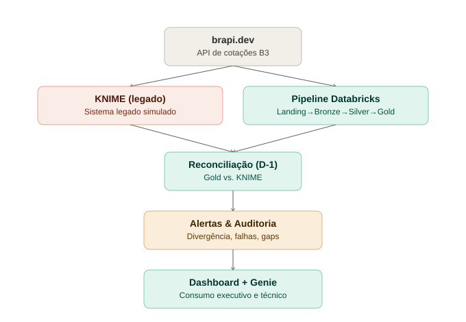

# Arquitetura — Modernização de Dados B3 (KNIME → Databricks)

> Este documento descreve as decisões técnicas de arquitetura do projeto. Contexto de negócio (o que é o índice-proxy, por que esses tickers, indicadores) vive em `docs/business-context.md`. Decisões pontuais e seus trade-offs detalhados vivem em `docs/adr/`.

## 1. Entendimento do problema

Construir um projeto de portfólio que simule o escopo de uma vaga real de modernização de dados da B3: migração de pipelines legados (ferramenta visual + procedures, aqui simulada por KNIME no lugar de Alteryx) para uma arquitetura moderna em Databricks, com foco em governança, escalabilidade e cálculo de um índice financeiro — 100% dentro do Databricks Free Edition, dentro de um prazo de execução curto.

## 2. Premissas adotadas

- Plataforma alvo: **Databricks Free Edition** — serverless-only, sem private networking, outbound restrito a domínios confiáveis (testado e confirmado compatível com `brapi.dev` e GitHub — ver `databricks/tests/`), sem SLA/suporte.
- **KNIME Analytics Platform** no lugar de Alteryx, por ser gratuito e open source sem exigência de conta corporativa — não é um clone funcional do Alteryx, simula o *padrão* de migração ferramenta-visual → código.
- Fonte única de dados: [brapi.dev](https://brapi.dev), API REST gratuita, sandbox sem token, para 4 tickers (PETR4, VALE3, MGLU3, ITUB4). A API retorna a cotação **atual** no momento da chamada — não há endpoint de cotação histórica no plano gratuito.
- "Índice" calculado é um **proxy simplificado** (média simples do retorno diário dos 4 papéis), não a metodologia oficial de nenhum índice real da B3 — ver `docs/business-context.md`.
- Governança e time: projeto solo, portfólio público — sem requisitos de compliance regulatório real, sem SLA contratual.

## 3. Arquitetura proposta

Fonte única (`brapi.dev`) alimenta KNIME (legado) e o pipeline Databricks (Landing → Bronze → Silver → Gold) de forma independente. Os dois convergem na Reconciliação (D-1), que alimenta Alertas e Auditoria automáticos. A camada de consumo (Dashboard + Genie) expõe tudo isso a públicos executivo e técnico.

KNIME e Databricks consomem a **mesma fonte de forma independente** (ver [ADR-01](adr/adr-01-ingestao-independente-landing.md)) — o Databricks não lê o CSV de saída do KNIME em nenhum ponto do fluxo Bronze/Silver/Gold.

> **Correção de escopo (27/08):** a comparação histórica entre KNIME e Databricks cobre **27/08, 28/08 e 31/08** — não 26/08. A infraestrutura Databricks (catalog, schemas, Volume) só foi criada em 27/08, e a API `brapi.dev` não permite obter retroativamente o preço de um dia anterior à criação. O CSV do KNIME de 26/08 permanece no repositório como primeiro registro histórico do sistema legado, mas fica fora da janela de reconciliação.
>
> **Segunda correção de escopo (03/09):** um bug de cache no KNIME (ver [ADR-16](adr/adr-16-bug-cache-knime-janela-reconciliacao.md)) manteve o resultado congelado de 27/08 em todas as execuções seguintes até 01/09 — o `GET Request` nunca capturou dado novo nesse período, apesar da data do arquivo mudar a cada dia. **A janela de reconciliação genuinamente válida (dado real dos dois lados) começa apenas em 02/09/2026**, não em 27/08 como documentado anteriormente. As reconciliações de 27/08 a 01/09 permanecem no histórico, com causa raiz corrigida, mas não provam nem invalidam a migração — um dos dois lados nunca teve dado real nesse período.

### Unity Catalog — convenção de nomes

Catalog único `poc_b3_modernizacao`, schema por camada, criados em 27/08/2026:

| Schema | Conteúdo | Tags aplicadas |
|---|---|---|
| `poc_b3_modernizacao.landing` | Volume `raw` — arquivos JSON brutos da API, organizados por `data=AAAA-MM-DD/` | `ambiente=poc`, `dominio=mercado-financeiro`, `projeto=b3-modernizacao-dados`, `camada=landing` |
| `poc_b3_modernizacao.bronze` | Tabelas Delta, cópia fiel por sistema, sem tratamento de tipo ou conteúdo | `camada=bronze` (+ tags comuns acima) |
| `poc_b3_modernizacao.silver` | Tabelas Delta tipadas, deduplicadas, com regra de qualidade e quarentena | `camada=silver` (+ tags comuns acima) |
| `poc_b3_modernizacao.gold` | Tabelas Delta com o índice-proxy, gerada de forma automatizada via Job | `camada=gold` (+ tags comuns acima) |
| `poc_b3_modernizacao.reconciliation` | Resultado da comparação entre Gold e KNIME, por data — nível agregado e detalhado | `camada=reconciliation` (+ tags comuns acima) |
| `poc_b3_modernizacao.observability` | Log de execução dos notebooks do pipeline — responde se quebrou, quando e por quê | `camada=observability` (+ tags comuns acima) |

Todos os catalog/schemas têm descrição registrada no momento da criação. A partir do schema `reconciliation`, a criação passou a ser feita via código (`databricks/setup/00_setup_catalog`), não mais manualmente pela interface — ver [ADR-07](adr/adr-07-reconciliacao-formato-tolerancia-manual.md).

### Camadas

| Camada | Conteúdo | Status |
|---|---|---|
| **Landing (Volume UC)** | Cópia bruta e imutável da resposta da API `brapi.dev`, com metadados de ingestão. Ver [ADR-01](adr/adr-01-ingestao-independente-landing.md) e [ADR-02](adr/adr-02-widgets-idempotencia-landing.md). | ✅ Implementado (`databricks/landing/01_ingestao_landing`) |
| **Bronze** | Tabelas Delta, cópia fiel da fonte, imutável. | ✅ Implementado (`databricks/bronze/02_bronze`) — validação de integridade, ver [ADR-03](adr/adr-03-merge-bronze-validacao-integridade.md) |
| **Silver** | Tipagem, deduplicação, pelo menos 1 regra de qualidade com tabela de quarentena (ex.: preço nulo/negativo desviado, sem quebrar o pipeline). | ✅ Implementado (`databricks/silver/03_silver`) — quarentena unificada, ver [ADR-04](adr/adr-04-quarentena-dedup-schema-silver.md) |
| **Gold** | Cálculo do índice-proxy em PySpark/SQL, orquestrado como Job no Databricks Workflows. | ✅ Implementado (`databricks/gold/04_gold`) — 5 indicadores (incluindo índice acumulado), ver [ADR-05](adr/adr-05-indicadores-gold-automatizada.md), [ADR-09](adr/adr-09-indice-acumulado-capitalizacao-composta.md). Orquestração via Job implementada, ver [ADR-06](adr/adr-06-orquestracao-workflows-yaml.md). |
| **Reconciliação** | Notebook comparando Gold (Databricks) com a saída do KNIME — contagem de linhas e valor do índice, por data. | ✅ Implementado, **automatizado via Job (D-1)** — janela genuinamente válida a partir de 02/09 (ver [ADR-16](adr/adr-16-bug-cache-knime-janela-reconciliacao.md)). Ver [ADR-10](adr/adr-10-reconciliacao-d1-automatizada.md) |

## 4. Componentes e justificativa

| Componente | Por que esse e não outro |
|---|---|
| **brapi.dev** | API REST gratuita, sandbox funciona sem token para os tickers escolhidos — preferida ao `.zip` oficial da B3 (COTAHIST), incompatível com o prazo do projeto. |
| **Volume UC como landing, antes da Bronze** | Desacopla "buscar o dado" de "estruturar o dado em tabela", preserva a resposta bruta como evidência auditável. Ver [ADR-01](adr/adr-01-ingestao-independente-landing.md). |
| **KNIME e Databricks consumindo a fonte de forma independente** | Sustenta a reconciliação Gold vs. KNIME como prova de migração de lógica de negócio, não apenas de output. **Validado na prática, não só em teoria**: um bug de cache que travou o KNIME por 6 dias (ver [ADR-16](adr/adr-16-bug-cache-knime-janela-reconciliacao.md)) nunca contaminou o pipeline Databricks, exatamente por essa independência. Ver [ADR-01](adr/adr-01-ingestao-independente-landing.md). |
| **CSVs do KNIME e JSONs do Volume versionados por data** | Permite comparação histórica real entre execuções de dias diferentes, em vez de um único snapshot sobrescrito. |
| **Widgets (`dbutils.widgets`) no notebook de ingestão** | Parametrização de ticker, data de referência e modo de execução — permite reprocessamento pontual e isolamento de um único papel sem editar código. Ver [ADR-02](adr/adr-02-widgets-idempotencia-landing.md). |
| **Databricks Workflows para orquestração** | Nativo, sem custo extra, disponível na Free Edition — orquestra Bronze → Silver → Gold como Job. |
| **Databricks Git folders** | Conecta o workspace diretamente ao repositório GitHub, permitindo commits via branch + PR direto da interface do Databricks. |
| **Geração da Gold exclusivamente via código** | Nenhum valor é editado manualmente em tabela Gold — implementa a primeira metade do modelo de governança pretendido (a segunda metade, RBAC por papel, permanece pendente). Ver [ADR-05](adr/adr-05-indicadores-gold-automatizada.md). |
| **Databricks Workflows (Job `pipeline_diario_b3`)** | Orquestra 7 Tasks em cadeia (Landing → Bronze → Silver → Gold → Reconciliação → Alerta de Divergência → Auditoria de Execuções), agendado para dias úteis às 17h15, com notificação de falha e duração por e-mail. Completa a automação real do pipeline, sem intervenção manual. Ver [ADR-06](adr/adr-06-orquestracao-workflows-yaml.md), [ADR-10](adr/adr-10-reconciliacao-d1-automatizada.md), [ADR-12](adr/adr-12-alertas-nativos-falha-duracao.md), [ADR-13](adr/adr-13-tryexcept-completo-alerta-divergencia.md), [ADR-15](adr/adr-15-auditoria-automatica-execucoes.md). |
| **YAML do Job exportado como documentação** | Aproxima o projeto de IaC sem o custo completo de Databricks Asset Bundles — cópia de referência versionada, não fonte de verdade deployada. Ver [ADR-06](adr/adr-06-orquestracao-workflows-yaml.md). |
| **Notebook utilitário compartilhado (`%run`)** | Centraliza `merge_ou_cria` e `registrar_execucao`, eliminando duplicação de código entre notebooks e viabilizando a observabilidade de forma consistente. Ver [ADR-08](adr/adr-08-observabilidade-modulo-compartilhado.md). |
| **AI/BI Dashboard + Genie Space** | Camada de consumo em 2 páginas: "Visão Geral" (executiva — índice acumulado, ranking, reconciliação) e "Observabilidade Técnica" (histórico de execuções, anomalias com causa raiz, gaps, indicadores de saúde do pipeline). Genie com acesso curado (só Gold e Reconciliação) e instruções embutindo as ressalvas de domínio do projeto. Ver [ADR-11](adr/adr-11-dashboard-genie-consumo-executivo.md), [ADR-15](adr/adr-15-auditoria-automatica-execucoes.md), [ADR-17](adr/adr-17-dashboard-correcoes-observabilidade-tecnica.md). |
| **Try/except em todos os 5 notebooks do pipeline** | Registro explícito de `status = "falha"` com `mensagem_erro`, não apenas ausência de registro — necessário consolidar a lógica principal numa única célula por notebook, já que Databricks não permite capturar exceção entre células. Ver [ADR-13](adr/adr-13-tryexcept-completo-alerta-divergencia.md). |
| **Databricks Secret Scope (`b3-secrets`)** | Credencial de e-mail (senha de aplicativo Gmail) nunca em texto no código — criado via CLI no Web Terminal, validado com teste de redação automática. Ver [ADR-13](adr/adr-13-tryexcept-completo-alerta-divergencia.md). |
| **Alerta de divergência anormal (aditivo)** | Notebook `06_alerta_divergencia` lê o resultado já gravado pela reconciliação e dispara e-mail apenas quando a diferença ultrapassa 1% — não altera a lógica de `05_reconciliacao`. Ver [ADR-13](adr/adr-13-tryexcept-completo-alerta-divergencia.md). |
| **Auditoria automática de execuções** | Notebook `07_auditoria_execucoes` detecta execuções próximas, gaps e duração anormal em `pipeline_runs`, gravando com `inserir_se_novo` (insere só o que é novo, preservando `causa_raiz` anotada manualmente). Detecção automática, causa raiz continua sendo investigação humana. Ver [ADR-15](adr/adr-15-auditoria-automatica-execucoes.md). |

## 5. Limitações conhecidas da Free Edition e como o desenho já as absorve

| Limite | Como o desenho contorna |
|---|---|
| Outbound restrito a domínios confiáveis | Testado e confirmado no Dia 1 (`databricks/tests/teste_b3.ipynb`): `brapi.dev` e `api.github.com`/`github.com` acessíveis sem bloqueio. |
| Sem SLA/suporte, uso não comercial | Aceitável — natureza de portfólio, não produto em produção. |
| 1 workspace / 1 metastore por conta | Sem impacto — projeto não requer múltiplos ambientes (dev/staging/prod) nesta fase. |

## 6. Riscos e mitigação

| Risco | Mitigação |
|---|---|
| Divergência de preço entre a chamada do KNIME e a do Databricks no mesmo dia (dado em tempo real, muda durante o pregão) | Execução padronizada de ambos após o fechamento do pregão (**17h15**), eliminando a janela de variação intraday. |
| "Índice" proxy confundido com metodologia oficial de um índice real (ex.: Ibovespa) numa entrevista | Ressalva explícita no README e em `docs/business-context.md`. |
| Prazo curto competindo com escopo de automação (agente de commit) | Agente tratado como extra condicional, só entra se o cronograma técnico central fechar no prazo — não faz parte do caminho crítico. |
| Execução de teste sobrescrevendo silenciosamente a execução oficial do dia, sem registro | Resolvido pela decisão de "um snapshot por dia" (KNIME) e MERGE idempotente (Databricks) — ver [ADR-02](adr/adr-02-widgets-idempotencia-landing.md). |
| API `brapi.dev` retornando `regularMarketPreviousClose` idêntico a `regularMarketPrice` quando consultada muito próxima ao fechamento, zerando o índice-proxy do dia | Comportamento recorrente da fonte externa (observado em 27/08, 31/08, 01/09, 03/09), não falha do pipeline. Relevante para a interpretação da reconciliação: um índice zerado num dos dias não deve ser lido como "sem movimento no mercado", mas como efeito do horário de captura. Ver [ADR-06](adr/adr-06-orquestracao-workflows-yaml.md). |
| Job `pipeline_diario_b3` executando mais de uma vez próximo no tempo, em 28/08, 01/09 e 02/09 | **Investigado e explicado em todos os casos** — reprocessamentos manuais legítimos (sincronização tardia do KNIME em 28/08; testes de try/except em 01/09; investigação do bug de cache do KNIME em 02/09, incluindo cancelamento e reexecução célula a célula). Sem impacto de dado (MERGE idempotente). Ver [ADR-15](adr/adr-15-auditoria-automatica-execucoes.md). |
| Execuções de `01_ingestao_landing` com duração anormal: 01/09 (157,87s) e 03/09 (638,6s) | Ambos os casos confirmados pelo autor como execuções manuais perceptivelmente lentas, sem causa técnica confirmada — o de 03/09 associado a múltiplos programas abertos na máquina local no momento da execução (não confirmado se essa foi de fato a causa, já que o compute é serverless na nuvem). Registrados como "requer atenção"/"aguardando mais amostras", não descartados. Ver [ADR-15](adr/adr-15-auditoria-automatica-execucoes.md). |
| Limiar de duração do Job (5 min, por Task e no total) abaixo do tempo real em pelo menos uma execução (03/09: 14,36 min total, disparando os 2 alertas de duração) | Recalibração ainda não aplicada — amostra única associada a uma causa externa não confirmada (máquina local do autor), não a uma degradação real e recorrente do pipeline. Aguardando mais execuções agendadas antes de decidir. Ver [ADR-13](adr/adr-13-tryexcept-completo-alerta-divergencia.md), [ADR-15](adr/adr-15-auditoria-automatica-execucoes.md). |
| KNIME preservando estado de execução em cache junto com o workflow salvo — "Execute all" não força reexecução de nós que aparentam já estar prontos | **Descoberto e corrigido em 03/09** — o `GET Request` e o cálculo do índice-proxy ficaram travados no resultado de 27/08 até 01/09, invalidando a reconciliação desse período. Corrigido via `Reset all` antes de `Execute all`, agora parte do processo operacional padrão do projeto. Ver [ADR-16](adr/adr-16-bug-cache-knime-janela-reconciliacao.md). |

## 7. Evolução — possíveis próximos passos

Itens abaixo são **roadmap reconhecido, genuinamente não implementado** — para o que já foi feito, ver seção 9 (Status atual). Documentados deliberadamente para demonstrar maturidade de arquitetura mesmo sem tempo de execução.

- **Databricks Asset Bundles (IaC completo) / CI-CD real**: padrão mais robusto para deploy entre ambientes, testes automatizados por PR. O YAML exportado do Job (ver [ADR-06](adr/adr-06-orquestracao-workflows-yaml.md)) é o primeiro passo nessa direção, não a solução completa.
- **Agente de automação de commit/PR** via API REST do GitHub — mecânica já validada em projeto anterior. Candidato a extra, condicionado a sobra de tempo.
- **Governança de acesso (RBAC)**: modelo pretendido — arquitetos com acesso completo a todas as camadas; engenharia limitada a Bronze e Silver; negócio limitado a Silver. A geração automatizada da Gold (ver [ADR-05](adr/adr-05-indicadores-gold-automatizada.md)) já implementa metade desse modelo; RBAC real no Unity Catalog permanece não implementado.
- **Escalabilidade**: caminho de 4 tickers para uma lista maior (ex.: 500 papéis, ou o pregão completo) — ver documento de referência dedicado em `docs/anexos/`. Principal gargalo identificado: chamadas de API sequenciais na ingestão (ver [ADR-14](adr/adr-14-finops-armazenamento-dbu.md)), não o volume de dado em si. Nesse cenário, também passaria a fazer sentido avaliar **Programação Orientada a Objetos** — deliberadamente não adotada nesta fase, por não haver ainda repetição de estrutura real que justifique a abstração.
- Ampliação do índice-proxy para mais tickers ou ponderação por `marketCap`, caso o projeto seja retomado após a entrega.
- **Propagação consistente de `modo_execucao`** via Widget em todos os notebooks (hoje só `01_ingestao_landing` e `02_bronze` têm esse Widget).
- **Determinar a causa raiz do caso de duração anormal de 01/09** (`01_ingestao_landing`, 157,87s) — o único, entre as anomalias registradas, sem nenhuma explicação (nem confirmada, nem reportada).
- **Recalibração do limiar de duração do Job** — aguardando mais execuções agendadas antes de decidir um novo número, evitando ajustar em cima de uma amostra isolada.
- **Adicionar observabilidade ao `06_alerta_divergencia`**: hoje é o único notebook do pipeline sem `try/except` nem chamada a `registrar_execucao` — uma falha nele não aparece em `observability.pipeline_runs` nem seria pega pela auditoria automática (ADR-15).

## 8. Perguntas de negócio e operacionais — o que o projeto já responde

Registradas aqui deliberadamente, mesmo as que ainda não têm resposta plena pelo pipeline — mostrar honestamente o que está e o que não está coberto é parte da maturidade que o projeto pretende demonstrar.

**Quais ações mais se valorizaram?**
✅ Respondível pelo pipeline desde a conclusão da Gold: `gold.indicadores_diarios`, coluna `ranking_valorizacao`, ordenada por `retorno_diario_pct`. Ver [ADR-05](adr/adr-05-indicadores-gold-automatizada.md).

**Quando podemos encerrar o fluxo do KNIME?**
Já respondível conceitualmente: o KNIME existe exclusivamente para sustentar a reconciliação (prova de que a lógica de negócio foi preservada na migração). Pode ser formalmente encerrado após acumular uma janela sólida de reconciliações **genuinamente válidas** — ou seja, a partir de 02/09/2026 em diante (ver [ADR-16](adr/adr-16-bug-cache-knime-janela-reconciliacao.md); as reconciliações de 27/08 a 01/09 não contam, por um bug de cache do KNIME que invalidou o dado desse período).

**O que usamos para o fluxo de CI/CD?**
Hoje, nada equivalente a CI/CD real — o que existe é controle de versão (Git: branch → commit → PR → merge), que é disciplina de versionamento, não integração/entrega contínua. Um CI/CD real (testes automatizados por PR, deploy automatizado de notebooks/Jobs, validação de schema antes de promover) depende de **Databricks Asset Bundles**, já registrado como evolução futura (seção 7) e não implementado por restrição de prazo — decisão consciente, não lacuna não percebida.

## 9. Status atual e próximos passos

**ADRs escritos:**
- [ADR-01 — Ingestão independente via Volume UC (Landing)](adr/adr-01-ingestao-independente-landing.md)
- [ADR-02 — Parametrização via Widgets e escrita idempotente na Landing Zone](adr/adr-02-widgets-idempotencia-landing.md)
- [ADR-03 — Escrita idempotente na Bronze via MERGE e coluna de validação de integridade](adr/adr-03-merge-bronze-validacao-integridade.md)
- [ADR-04 — Quarentena unificada, deduplicação e schema explícito na Silver](adr/adr-04-quarentena-dedup-schema-silver.md)
- [ADR-05 — Indicadores da camada Gold e geração exclusivamente automatizada](adr/adr-05-indicadores-gold-automatizada.md)
- [ADR-06 — Orquestração via Databricks Workflows e YAML como documentação leve de IaC](adr/adr-06-orquestracao-workflows-yaml.md)
- [ADR-07 — Reconciliação Gold vs. KNIME: formato, tolerância e execução manual](adr/adr-07-reconciliacao-formato-tolerancia-manual.md)
- [ADR-08 — Observabilidade via log de execução e módulo utilitário compartilhado](adr/adr-08-observabilidade-modulo-compartilhado.md)
- [ADR-09 — Índice acumulado (base 100) via capitalização composta](adr/adr-09-indice-acumulado-capitalizacao-composta.md)
- [ADR-10 — Reconciliação automatizada D-1, tratamento explícito de erro e correção de dado residual](adr/adr-10-reconciliacao-d1-automatizada.md)
- [ADR-11 — Camada de consumo executivo: AI/BI Dashboard e Genie Space](adr/adr-11-dashboard-genie-consumo-executivo.md)
- [ADR-12 — Alertas nativos de falha e duração no Job](adr/adr-12-alertas-nativos-falha-duracao.md)
- [ADR-13 — Try/except completo no pipeline e alerta de divergência anormal aditivo](adr/adr-13-tryexcept-completo-alerta-divergencia.md)
- [ADR-14 — Simulação de FinOps: armazenamento e consumo de DBU](adr/adr-14-finops-armazenamento-dbu.md)
- [ADR-15 — Auditoria automática de execuções, preservando investigação humana](adr/adr-15-auditoria-automatica-execucoes.md)
- [ADR-16 — Bug de cache no KNIME: dados congelados invalidam a reconciliação de 27/08 a 01/09](adr/adr-16-bug-cache-knime-janela-reconciliacao.md)
- [ADR-17 — Dashboard: correções de dado, causa raiz dinâmica e página de observabilidade técnica](adr/adr-17-dashboard-correcoes-observabilidade-tecnica.md)

**Infraestrutura já criada:**
- Repositório GitHub estruturado (`docs/adr`, `knime`, `databricks/{setup,landing,bronze,silver,gold,jobs,reconciliation,tests}`)
- Git folder conectando o Databricks ao repositório
- Workflow KNIME completo e funcional, 7 execuções reais (26/08, 27/08, 28/08, 31/08, 01/09, 02/09, 03/09) — as 5 primeiras afetadas por um bug de cache não percebido na hora (ver [ADR-16](adr/adr-16-bug-cache-knime-janela-reconciliacao.md)), corrigido em 02/09; 02/09 e 03/09 já seguindo o novo processo (Reset all + Execute all).
- Catalog `poc_b3_modernizacao` e os 6 schemas (`landing`, `bronze`, `silver`, `gold`, `reconciliation`, `observability`), criados via código
- Volume `poc_b3_modernizacao.landing.raw`
- Tabelas: `bronze.cotacoes`, `silver.cotacoes`, `silver.cotacoes_quarentena`, `gold.indicadores_diarios`, `gold.indice_proxy`, `gold.indice_acumulado`, `reconciliation.resultado_indice`, `reconciliation.resultado_detalhado`, `observability.pipeline_runs`, `observability.auditoria_anomalias`, `observability.auditoria_gaps`
- Databricks Secret Scope `b3-secrets` (criado via CLI no Web Terminal), contendo `gmail-app-password`, nunca em texto no código
- Job `pipeline_diario_b3`: **7 Tasks em cadeia** (Landing → Bronze → Silver → Gold → Reconciliação → Alerta de Divergência → Auditoria de Execuções), agendado dias úteis às 17h15, notificação de falha e duração por e-mail (2 endereços, propósitos distintos). YAML reexportado após a 7ª Task. Tempo de execução observado variando de ~3,4 min a 14,36 min conforme condições da execução (ver riscos, seção 6) — o limiar de 5 min já foi ultrapassado em pelo menos uma execução manual, disparando os alertas corretamente.
- AI/BI Dashboard "B3 - Modernização de Dados" (publicado), **2 páginas**:
  - **"Visão Geral"** (executiva): índice acumulado, ranking de valorização (corrigido para mostrar o dia de maior dispersão da janela, não o mais recente — evita gráfico zerado por comportamento conhecido da API perto do fechamento), reconciliação (causa raiz dinâmica, refletindo automaticamente a correção do bug de cache do KNIME — ver ADR-16).
  - **"Observabilidade Técnica"** (nova): histórico de execuções, anomalias detectadas (com causa raiz e cores condicionais), gaps de execução, 2 gráficos de indicadores de saúde (taxa de sucesso, status de investigação das anomalias) — todos com descrição dinâmica, sem números fixos no texto.
  - Durante a construção, dois bugs reais foram encontrados e corrigidos (ver [ADR-17](adr/adr-17-dashboard-correcoes-observabilidade-tecnica.md)): formatação de percentual duplicada no gráfico de ranking (valor já em % sendo multiplicado por 100 de novo pela formatação do widget) e causa raiz do painel de reconciliação usando texto fixo em vez de refletir a coluna real da tabela (mascararia a correção do ADR-16 se não corrigido).
- Genie Space "Genie B3 - Modernização de Dados", acesso curado (Gold + Reconciliação), instruções com ressalvas de domínio, 3 exemplos de pergunta+SQL — testado com perguntas reais, respostas corretas e com as ressalvas de domínio aplicadas automaticamente.
- `docs/anexos/`: materiais de referência fora da narrativa central de ADR — planilhas de simulação de custo de armazenamento (Databricks e Azure) e documento de escalabilidade técnica (4 → 500 tickers). Ver [ADR-14](adr/adr-14-finops-armazenamento-dbu.md).

**Testes realizados:**
- Conectividade do Databricks Free Edition com `brapi.dev` e GitHub — confirmados acessíveis.
- Execuções reais do Job agendado (27/08, 28/08, 31/08, 01/09, 02/09, 03/09, 17h15): sem intervenção manual.
- Try/except validado nos 5 notebooks, nos dois caminhos (sucesso e falha real, com falhas propositais reversíveis: URL/caminho/tabela inválidos).
- Alertas nativos validados: e-mail de falha e de duração recebidos corretamente.
- Alerta de divergência anormal validado por simulação controlada: e-mail HTML recebido com o layout e dados corretos.

**Padrão de desenvolvimento adotado:** PySpark como linguagem primária. Funções compartilhadas via `%run` (`merge_ou_cria`, `registrar_execucao`, `inserir_se_novo` — este último preserva anotação manual em reexecuções, ver [ADR-15](adr/adr-15-auditoria-automatica-execucoes.md)). Exceções documentadas: datasets do AI/BI Dashboard em SQL (única forma nativa nessa ferramenta — ver [ADR-11](adr/adr-11-dashboard-genie-consumo-executivo.md)); envio de e-mail via `smtplib`/`email.mime` (sem alternativa nativa em PySpark para essa finalidade).

**Dívida técnica:** `06_alerta_divergencia` **não tem** try/except nem chamada a `registrar_execucao` — diferente dos demais 6 notebooks do pipeline, uma falha nele não fica registrada em `observability.pipeline_runs` nem seria detectada pela auditoria automática (ADR-15). `modo_execucao` inconsistente entre notebooks (só `01` e `02` têm Widget); 2 casos de duração anormal sem causa confirmada (01/09 e 03/09, ambos em `01_ingestao_landing`); limiar de duração do Job (5 min) precisa de mais amostras antes de recalibrar — hoje (03/09) uma execução com múltiplos programas locais abertos levou 14,36 min ao todo, disparando os 2 alertas nativos (Task e Job), mas tratado como possível causa externa não confirmada; mensagens dos alertas nativos permanecem no template padrão (decisão de escopo, não lacuna).

**Código já implementado (resumo):** `00_setup_catalog`, `01_utilitarios_pipeline` (funções compartilhadas), `01_ingestao_landing`, `02_bronze`, `03_silver`, `04_gold` (5 indicadores, incluindo índice acumulado — ver ADR-09), `05_reconciliacao` (D-1 automático — ver ADR-10), `06_alerta_divergencia` (aditivo — ver ADR-13), `07_auditoria_execucoes` (detecção automática de anomalias — ver ADR-15), `pipeline_diario_b3.yml`, AI/BI Dashboard e Genie Space (ver ADR-11). Todos os 5 notebooks do pipeline core com try/except completo (ver ADR-13).

**Incidentes encontrados e corrigidos:**
- Linha residual incorreta na reconciliação (28/08), gerada por join `outer` sobre dias sem correspondência real — corrigida por `DELETE` direcionado, causa eliminada estruturalmente. Ver [ADR-10](adr/adr-10-reconciliacao-d1-automatizada.md).
- Status HTTP de erro com corpo JSON válido não gerava exceção na ingestão — corrigido com `response.raise_for_status()`. Ver [ADR-13](adr/adr-13-tryexcept-completo-alerta-divergencia.md).
- 10 registros de teste (7 falhas propositais + 3 sucessos com timestamp confuso) identificados e removidos de `observability.pipeline_runs`. Ver [ADR-13](adr/adr-13-tryexcept-completo-alerta-divergencia.md).

**Estado dos dados:**
- CSVs do KNIME: 26/08 a 01/09 gravados com dado congelado por bug de cache (ver [ADR-16](adr/adr-16-bug-cache-knime-janela-reconciliacao.md)), causa raiz corrigida nas tabelas de reconciliação; 02/09 e 03/09 com dado real (já seguindo o novo processo de Reset all antes de Execute all).
- Reconciliação: 27/08 a 01/09 registradas mas não-probatórias (causa raiz corrigida para refletir o bug de cache); 02/09 é o primeiro dia genuinamente válido.
- Índice acumulado: base 100 em 27/08, evoluindo conforme novos dias são processados.

**Saúde operacional do pipeline (03/09):** 77+ execuções registradas, 100% com sucesso, 0 falhas (números seguem crescendo a cada execução agendada). 17 anomalias detectadas pela auditoria automática desde o início do projeto — 16 com causa raiz preenchida (a maioria confirmada; a de 03/09 é reportada pelo autor mas não tecnicamente confirmada, já que o compute é serverless na nuvem), 1 permanece sem nenhuma causa raiz identificada (duração anormal em `01_ingestao_landing`, 01/09). 0 gaps de execução esperada. Números exatos consultáveis a qualquer momento na página "Observabilidade Técnica" do Dashboard, que se atualiza automaticamente.

**Próximo passo real:** diagrama de arquitetura final; determinar causa do caso de duração anormal ainda em aberto; avaliar paralelização/lote das chamadas de API na ingestão antes de qualquer escala real (gargalo identificado na simulação de FinOps — ver [ADR-14](adr/adr-14-finops-armazenamento-dbu.md)); acumular mais amostras antes de decidir sobre recalibração do limiar de duração.